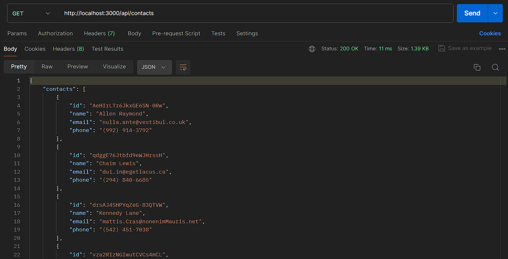
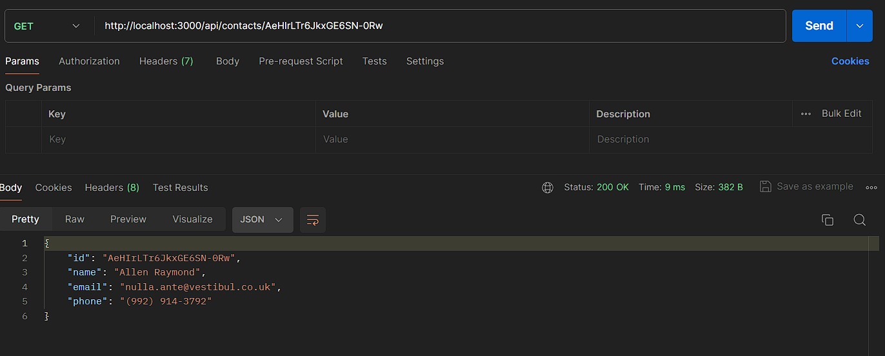
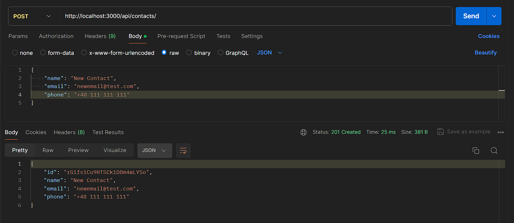
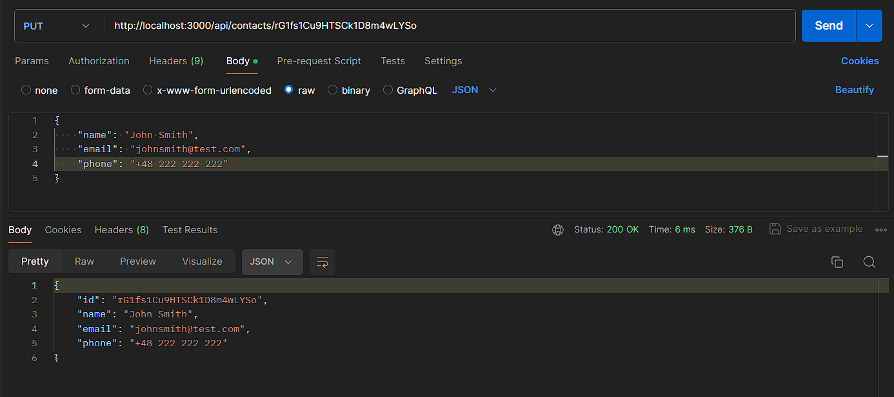
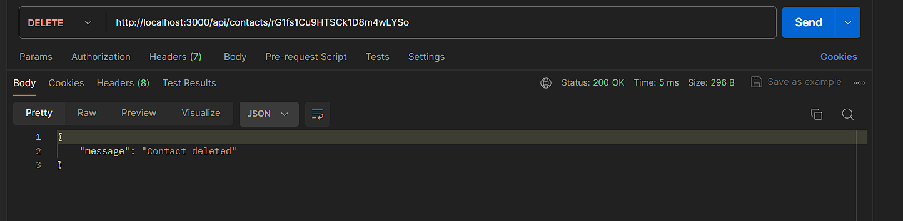

# goit-node-hw-02

## DEMO

GET `http://localhost:3000/api/contacts`

GETbyID `http://localhost:3000/api/contacts/CONTACT_ID`

POST `http://localhost:3000/api/contacts`

PUT `http://localhost:3000/api/contacts/CONTACT_ID`

DELETE `http://localhost:3000/api/contacts/CONTACT_ID`

## Technologies used

- Node
- JavaScript

## Setup and Usage

Clone this repo to your desktop and run `npm install` to install all the
dependencies. Once the dependencies are installed, you can run `npm run start:dev`

Open your browser or postman and check all available methods and endpoint's

- GET (contacts) : http://localhost:3000/api/contacts
- GET (find contact by id) : http://localhost:3000/api/contacts/CONTACT_ID
- POST (add new contact with json) : http://localhost:3000/api/contacts/
- PUT (update contact with json) : http://localhost:3000/api/contacts/CONTACT_ID
- DELETE (remove contact with unique id) : http://localhost:3000/api/contacts/CONTACT_ID
